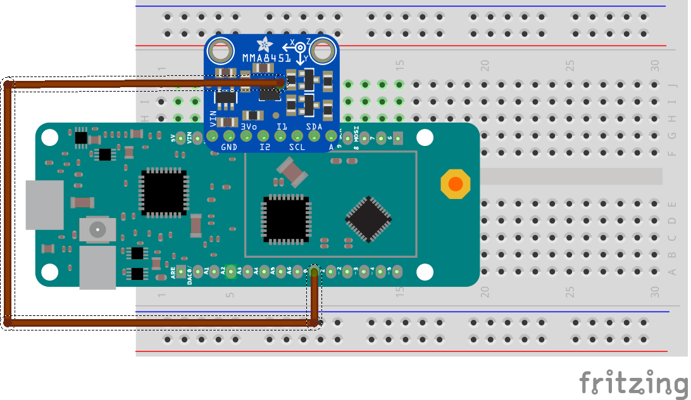

# MKRFoxMovementSensors
Arduino sketches for MKRFox 1200, MMA8451 accelerometer and DHT11 sensor.
Description of different sketches are defined below:

## MKRFOX-init
Sketch to retrieve ID and PAC on the board

## MKRFox-hello-world
Simple sketch to send an integer value

## SigfoxAccelAlarm
Project to send a sigfox message when movement is detected.

Source: https://create.arduino.cc/projecthub/45374/mkr-fox-1200-movement-trigger-dacbe0

## SigfoxMvtTemp
Project to report temperature/humidity periodically or when a movement is detected.

